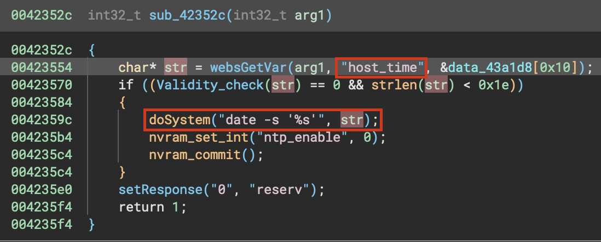

# Command injection vulnerability in totolink router

## Overview

- Manufacturer's website information：https://www.totolink.net/
- Firmware download address ：https://www.totolink.net/home/menu/detail/menu_listtpl/download/id/218/ids/36.html
- Version ：TOTOLINK X5000R V9.1.0u.6369_B20230113

## Product Information

## Analyse

TOTOLINK X5000R (V9.1.0u.6369_B20230113)was found to contain a command injection vulnerability in sub_42352c. This vulnerability allows an attacker to execute arbitrary commands through the "host_time" parameter.

The Validity_check function checks the user's packet data, but it is only valid for a specific string and can be bypassed with an unspecified string.

For example, redirections (>, <) can corrupt critical files inside the filesystem, which can lead to a DoS.

The vulnerability can be triggered via the "NTPSyncWithHost" function for setting the time of the firmware. An example payload is as follows
`{"host_time":"2024' > test'","topicurl":"NTPSyncWithHost"}`

These functions and many more are registered and used as callbacks in the main function of the cstecgi.cgi binary. Below is a code snippet of the main function and part of the table of functions registered as callbacks.

